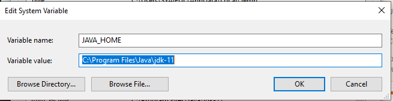

# weather_app

A new Flutter project.

## Getting Started

This project is a starting point for a Flutter application.

Before run this project on your local computer please run

- "flutter pub get" on your terminal to get all dependencies.
- "flutter run" to run this project on your device or you can press F% on your keyboard for debuging version.
- if you get an error about firebase, make sure you run on JAVA / Jdk 11 on your computer.
- changing the JAVA_HOME value in Environment Variabe to your java/jdk 11 path
  
- restart your IDE.
- run "flutter clean" & "flutter pub get" and try to run the project.

A few resources to get you started if this is your first Flutter project:

- [Lab: Write your first Flutter app](https://docs.flutter.dev/get-started/codelab)
- [Cookbook: Useful Flutter samples](https://docs.flutter.dev/cookbook)

For help getting started with Flutter development, view the
[online documentation](https://docs.flutter.dev/), which offers tutorials,
samples, guidance on mobile development, and a full API reference.
